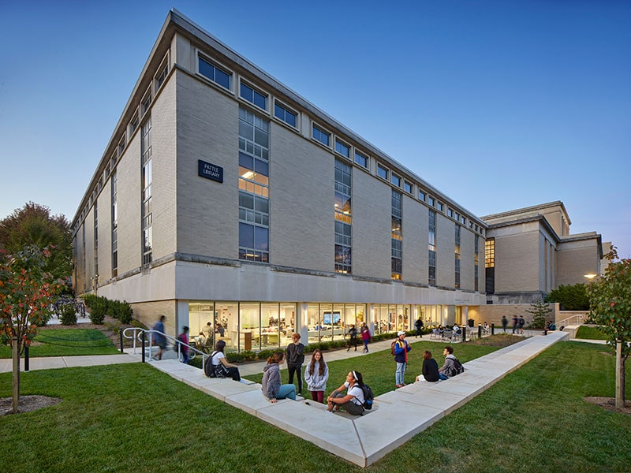
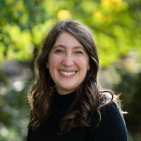

# Day 1 (Mon, May 11)

::: {.callout-caution}
## Work-in-progress
This schedule is a work-in-progress and is subject to change.
:::

::: {.callout-important}
## Logistics
**Times**: All times are Eastern Daylight Time (EDT).

:::: {.columns}
::: {.column width=70%}
**Location**: Dewey Room, West Pattee Knowledge Commons, unless otherwise indicated.

[Map](https://map.psu.edu/?id=1134#!ct/25403,26748,26749,26750,27255?m/407561?s/Pattee)

[Directions](wayfinding.qmd)
:::
::: {.column width=30%}
{.lightbox width="300px"}
:::
::::
:::

## Morning {- #day_1_am}

### 08:30 am • Breakfast   {-}

### 09:00 am • Bootcamp Overview {-}

Bootcamp Co-Directors

:::: {.columns}
::: {.column width=80%}
[Rick Gilmore](directors.qmd#rick-gilmore)
:::
::: {.column width=20%}
{width=100px height=100px}
:::
::::

:::: {.columns}
::: {.column width=80%}
[Alaina Pearce](directors.qmd#alaina-pearce)
:::
::: {.column width=20%}
{width=100px height=100px}
:::
::::

### 09:05 am • Welcoming Remarks

:::: {.columns}
::: {.column width=80%}
[Nathan Hall](presenters.qmd#nathan-f-hall)
:::
::: {.column width=20%}
{width=100px height=100px}

:::
::::

### 09:15 am • [Penn State Research Data Stewardship Program](sessions.html#research-data-stewardship-program) {-}

:::: {.columns}
::: {.column width=80%}
[Briana Wham](program-committee.qmd#briana-wham)
:::
::: {.column width=20%}
{width=100px height=100px}
:::
::::

### 09:45 am • Open @ Penn State {- #day_1_plenary_1}

<!-- - *Open Science and the HBCD and ABCD Cohorts*, [Koraly Perez-Edgar](presenters.qmd#koraly-pérez-edgar) -->
- *Sharing identifiable video data: Databrary.org and the PLAY Project*, [Rick Gilmore](directors.qmd#rick-gilmore)
- *Advancing reproducibility through team science, data sharing, and transparency: The ENIGMA initiative*, [Frank Hillary](program-committee.qmd#frank-hillary)

### 10:00 am • Break  {-}

### 10:15 am • Keynote {- #day_1_plenary_2}
- Responsible science at scale: Lessons for everyone from baby research and (really) large collaborations
:::: {.columns}
::: {.column width=80%}
[Melissa Kline Struhl](presenters.qmd#melissa-kline-struhl)
:::
::: {.column width=20%}
{width=100px height=100px}
:::
::::

### 11:30 am • Lunch & Discussion hour   {-}

#### The uses and misuses of open research data

Openly shared research data can be used for purposes beyond those envisioned by the scientists who originally collected the data.
Some of these uses advance discovery and some veer into misuse or worse misconduct.
What's the difference? Who decides? How can researchers who share data widely promote constructive uses? Come discuss these issues with us over lunch, informed by local experts who have been on the front lines of these issues.

:::: {.columns}
::: {.column width=50%}
](include/img/haupt-bernd.jpg){width=100px height=100px fig-align="left"}
:::
::: {.column width=50%}
](include/img/perez-edgar-koraly.jpeg){width=100px height=100px fig-align="left"}
:::
::::

*Resources*

- @McIntire2026-rg
- @ESIP2024-hn

## Afternoon {- #day_1_pm}

### 01:30 pm • Workshop session 1 {- #day_1_pm_session_1}

| Topic | Presenter | Location |
|--------------|----------|-------|
| [*Getting credit (Part I): Good enough data management practices*](sessions.html#getting-credit-part-i-good-enough-data-practices)[^1] | [Alaina Pearce](directors.qmd#alaina-pearce) | Dewey Room |
| [*Version control with git*](sessions.html#version-control-with-git) | [Carrie Brown](program-committee.qmd#carrie-brown) | W211A Pattee |

[^1]: This workshop contributes to the Provost Endorsement in Research Data Stewardship. Register for the program [here](https://pennstate.qualtrics.com/jfe/form/SV_0ppydquaUVYUN3U)]
: {tbl-colwidths="[60,20,20]"}

### 02:45 pm • Break  {-}

### 03:00 pm • Workshop session 2 {- #day_1_pm_session_2}

| Topic | Presenter | Location |
|--------------|----------|-------|
| [*Quarto (Part I): A tool for open scholarship*](sessions.html#quarto-part-i-a-tool-for-open-scholarship) | [Rick Gilmore](directors.qmd#directors.qmd#rick-gilmore) | W211A Pattee |
| [*Getting credit (Part II): Making your data make sense*](sessions.html#getting-credit-part-ii-making-your-data-make-sense)[^1] |  [Alaina Pearce](directors.qmd#alaina-pearce) | Dewey Room |

: {tbl-colwidths="[60,20,20]"}

### 04:15 pm • Day 1 wrap-up {-}

### 04:30 pm • End of Day 1 {-}

### 04:45 pm • Early career scholar social event   {-}

::: {.callout-important}
### Stay tuned
Join other early career researchers for an informal get-together.

Details to be announced soon.
:::

## References
