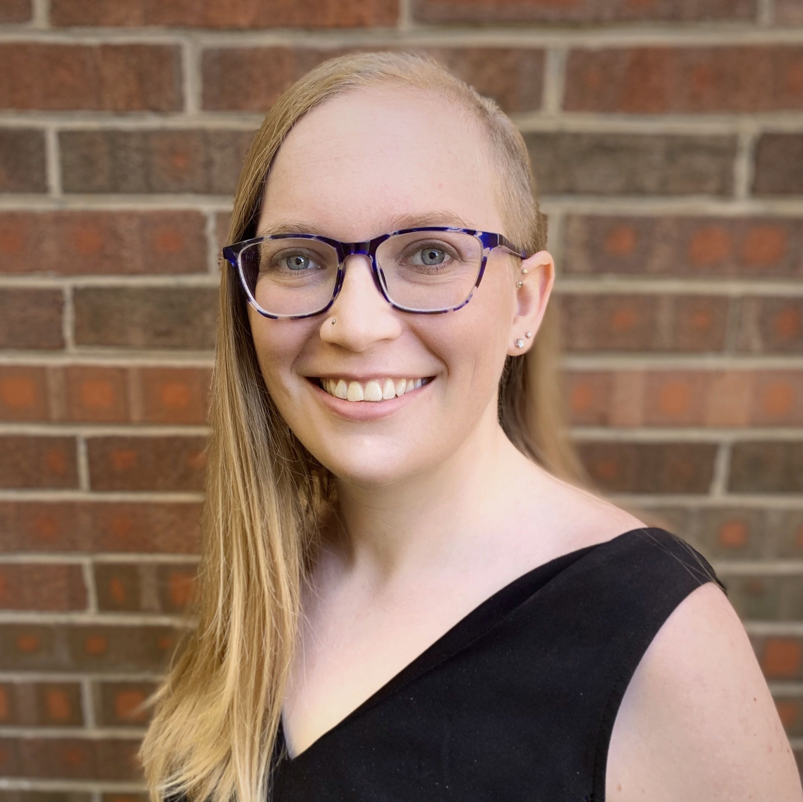
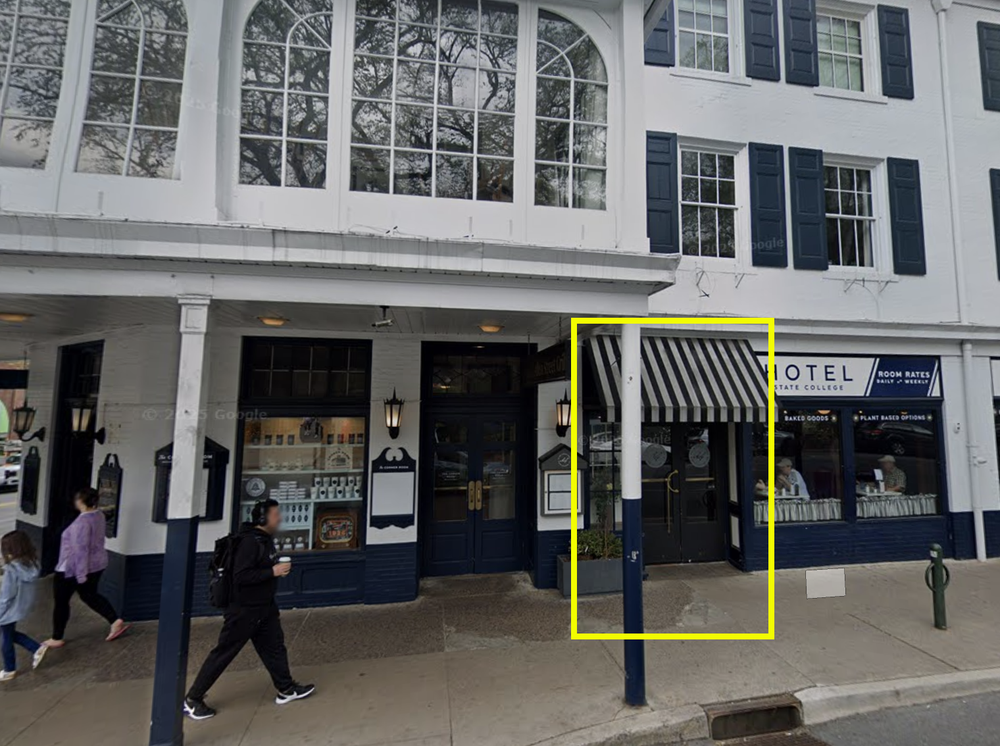
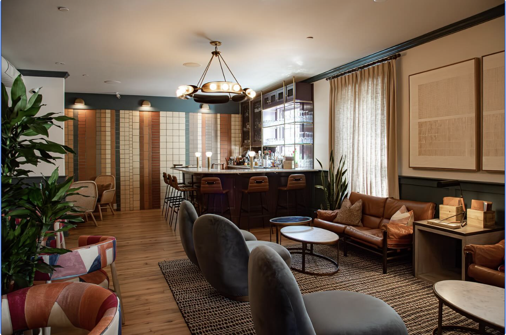

# Day 2 (Tues, May 12)

::: {.callout-caution}
## Work-in-progress
This schedule is a work-in-progress and subject to change.
:::

## Morning {- #day_2_am}

### 08:30 am • Breakfast   {-}

### 09:00 am • Welcome to Day 2 {-}

:::: {.columns}
::: {.column width=80%}
[Alaina Pearce](directors.qmd#alaina-pearce)
:::
::: {.column width=20%}
{width=100px height=100px}
:::
::::

### 09:15 am • Workshop session 3 {- #day_2_am_session_3}

| Topic | Presenter | Location |
|--------------|----------|-------|
| *Harnessing advanced cyberinfrastructure for research: An introduction to Roar and ICDS resources* | [Carrie Brown](program-committee.qmd#carrie-brown) | W211A Pattee |
| *Intro to copyright and open access publishing* | [Danielle Steinhart](presenters.qmd#danielle-steinhart) | Dewey Room |

: {tbl-colwidths="[60,20,20]"}

### 10:15 am • Break  {-}

### 10:30 am • Open @ Penn State

- [*Penn State Data Commons*](https://www.datacommons.psu.edu), [Maurie Kelly](presenters.qmd#maurie-kelly) 
- *Open scholarship and high performance computing*, [Wayne Figurelle](presenters.qmd#wayne-figurelle)

### 11:00 am Workshop session 4 {#day_2_am_session_4}

| Topic | Presenter | Location |
|--------------|----------|-------|
| *Quarto (Part II): Making useful things reproducibly* | [Rick Gilmore](directors.qmd#rick-gilmore) | W211A Pattee | 
| *Getting credit (Part III): Making your data citable* |  [Alaina Pearce](directors.qmd#alaina-pearce) | Dewey Room |

: {tbl-colwidths="[60,20,20]"}

<!-- :::: {.columns} -->
<!-- ::: {.column width=80%} -->
<!-- [Lynda Kellam](presenters.qmd#lynda-kellam), University of Pennsylvania -->
<!-- ::: -->
<!-- ::: {.column width=20%} -->
<!-- {width=100px height=100px} -->
<!-- ::: -->
<!-- :::: -->

<!-- ::: {.callout-important} -->
<!-- ## Location -->

<!-- Foster Auditorium (102 Paterno Library) -->
<!-- ::: -->

## Afternoon {- #day_2_pm}

### 12:00 pm • Lunch   {-}

### 01:30 pm • Panel Discussion {- #day_2_plenary_1}

#### Open research data and AI ethics

Sharing data openly is increasingly encouraged and sometimes mandated by funder policies. 
This panel explores ethical questions at the intersection of AI and open data. 
We'll discuss use of AI in the research lifecycle prior to sharing, to the role of AI in parsing and interrogating data after it is made publicly available. 
While some data may be shared with the explicit goal of being machine actionable, applying AI to more sensitive data such as de-identified human subjects data, introduces distinct risks.

:::: {.columns}
::: {.column width=33%}
](include/img/dancy-christopher.png){width="100px" height="100px" fig-align="left"}
:::
::: {.column width=33%}
](include/img/karmelita-courtney.jpg){width="100px" height="100px" fig-align="left"}
:::
::: {.column width=33%}
](include/img/slavkovic-alexandra.jpg){width="100px" height="100px"fig-align="left"}
:::
::: {.column width=33%}
](include/img/rui_zhang.jpg){width="100px" height="100px"fig-align="left"}
:::
::::

### 02:45 pm • Break  {-}

### 03:00 pm • Workshop session 5 {- #day_2_pm_session_5}

| Topic | Presenter | Location |
|--------------|----------|-------|
| *Quarto (Part III): Reproducible research reports* | [Rick Gilmore](directors.qmd#rick-gilmore) | TBD | 
| *Questionable research practices* |  [Jennifer Valcin](program-committee.qmd#jennifer-valcin) | W211A Pattee |

: {tbl-colwidths="[60,20,20]"}

### 04:15 pm • End of bootcamp wrap-up {- #day_2_pm_recap}

### 04:30 pm • Open scholarship happy hour  {- #day_2_happy_hour}

Hors d'oeuvres provided by the Bootcamp sponsors. Cash bar.

::: {.callout-important}
## Location -->

The Lobby Bar \
100 West College Avenue \
2nd floor, across from The Allen Street Grill

<iframe src="https://www.google.com/maps/embed?pb=!1m18!1m12!1m3!1d3020.538779612024!2d-77.86313658434075!3d40.79415282215678!2m3!1f0!2f0!3f0!3m2!1i1024!2i768!4f13.1!3m3!1m2!1s0x89cea898cdfb8a73%3A0xe610deef9fe200b0!2sAllen%20Street%20Grill!5e0!3m2!1sen!2sus!4v1752245481214!5m2!1sen!2sus" width="600" height="450" style="border:0;" allowfullscreen="" loading="lazy" referrerpolicy="no-referrer-when-downgrade"></iframe>

:::: {.columns}

::: {.column width=45%}
{.lightbox}
:::
::: {.column width=10%}
:::
::: {.column width=45%}
{.lightbox}
:::
::::

:::

