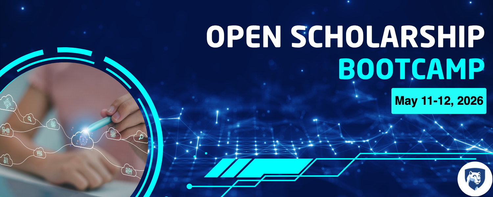

## About

This site documents and describes the 2026 Open Scholarship Bootcamp to be held on the University Park campus of [the Pennsylvania State University](https://www.psu.edu) Monday, May 11 and Tuesday, May 12, 2026.

## Goals {.unnumbered}

-   To create a focal point for activity and learning related to open scholarship practices.
-   To accelerate the development of a community of scholars who are interested in open scholarship.
-   To plan next steps that will foster the emergence of a robust open scholarship community at Penn State.

## Location

The Bootcamp will be held at the Pattee and Paterno Libraries on the Penn State University Park campus. See [this link](wayfinding.qmd) for specific directions.

## Registration

::: callout-important
## To register
Visit <https://forms.gle/BpCPnbrDUU3UMA869>.
:::

## Support

The Bootcamp would not be possible without the generosity of our sponsors:

:::::: columns
::: {.column width="40%"}
{fig-align="center"}
:::
::: {.column width="5%"}
:::
::: {.column width="55%"}
[Child Study Center (CSC)](https://csc.la.psu.edu)
:::
::::::

:::::: columns
::: {.column width="40%"}

:::
::: {.column width="5%"}
:::
::: {.column width="55%"}
[Penn State University Libraries](https://libraries.psu.edu)
:::
::::::
