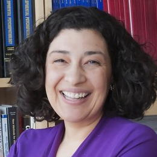

## Christopher Dancy {-}

:::: {.columns}
::: {.column width=50%}
{width=200px height=200px}
:::
::: {.column width=50%}
[Christopher L. Dancy, Ph.D](http://cdancy.com). is the Harold and Inge Marcus Industrial and Manufacturing Career Development Associate Professor with appointments in Industrial and Manufacturing Engineering and Computer Science and Engineering. He has research interests in AI and Cognitive Science, computational physiology, affective neuroscience, and emotion theory. Dancy creates information processing agents in software, using these agents for behavior simulation, theory exploration, HCI, and systems engineering purposes, and understanding agents and AI systems in the context of existing social structures
:::
::::

## Wayne Figurelle {-}

:::: {.columns}
::: {.column width=50%}
{width=200px height=200px}
:::
::: {.column width=50%}
Wayne Figurelle is Assistant Director of Innovation and Outreach at the Institute for Computational and Data Science Sciences (ICDS). Wayne has over 25 years of experience as a senior manager, with a focus in computer engineering. Figurelle joined Penn State in 2001 as senior technical specialist of the Pennsylvania Technical Assistance Program (PennTAP) and was promoted to director of PennTAP in 2006. He has also served as director of Industrial Innovation Programs and the EDA University Center in the Penn State College of Engineering. He joined ICS as assistant director in 2014. Prior to joining Penn State, he held positions at Raytheon and Link Computer Corporation.
:::
::::

## Nathan F. Hall {-}

:::: {.columns}
::: {.column width=50%}
{width=200px height=200px}
:::
::: {.column width=50%}
[Nathan F. Hall, Ph.D.](https://libraries.psu.edu/directory/nmh5768) is Associate Dean for Distinctive Collections and Digital Strategies and
Librarian with the Penn State University Libraries. He earned his doctoral degree in information science from the University of North Texas.
:::
::::

## Kyle Hallisky {-}

:::: {.columns}
::: {.column width=50%}
{width=200px height=200px}
:::
::: {.column width=50%}
[Kyle Hallisky](https://libraries.psu.edu/directory/nmh5768) is Associate Dean for Distinctive Collections and Digital Strategies and
Librarian with the Penn State University Libraries. He earned his doctoral degree in information science from the University of North Texas.
:::
::::

## Bernd Haupt {-}

:::: {.columns}
::: {.column width=50%}
{width=200px height=200px}
:::
::: {.column width=50%}
[Bernd Haupt, Ph.D.](https://eesi.psu.edu/who-we-are/our-people/bernd-haupt/) is Senior Research Associate, Systems Engineer, and Research Affiliate with the [Earth and Environmental Systems Institute (EESI)](https://eesi.psu.edu).
:::
::::

## Courtney Karmelita {-}

:::: {.columns}
::: {.column width=50%}
{width=200px height=200px}
:::
::: {.column width=50%}
[Courtney Karmelita, D.Ed.](https://researchsupport.psu.edu/orp-staff/courtney-karmelita/) is Chief of Staff for Penn State’s Office for Research Protections, Research Integrity Officer, and Executive Director of Ethical Research and Outreach. She oversees Quality Assurance, Research Integrity, and Education and Outreach Program. She also oversees data management monitoring and compliance at Penn State, advancing data stewardship initiatives across the university. Dr. Karmelita recently presented at the Council on Government Relations on the responsible use of AI in research. She leads Penn State’s AI Ethics Framework Working Group and participates on other AI literacy and risk assessment committees. Lastly, Dr. Karmelita was awarded a grant with the HHS Office of Research Integrity to organize Penn State's inaugural Research Ethics Conference. 
:::
::::

## Maurie Kelly {-}

:::: {.columns}
::: {.column width=50%}
{width=200px height=200px}
:::
::: {.column width=50%}
[Maurie Kelly, Ph.D.](https://iee.psu.edu/people/maurie-kelly) is Director of the Pennsylvania Spatial Data Access program, an instructor in the Smeal School of Business and the College of Information Science and Technology, and Director of the Penn State [Data Commons](https://www.datacommons.psu.edu).

[Maurie Kelly, Ph.D.](https://iee.psu.edu/people/maurie-kelly) is a member of the research faculty at Penn State Institute of Energy and the Environment where she serves as the Director of [Pennsylvania Spatial Data Access](https://pasda.psu.edu), the PA geospatial data access portal and the [Penn State Data Commons](https://datacommons.psu.edu), a PSU institutional research data repository.  In addition to PASDA and the Data Commons, she currently leads several big data/geospatial projects including the [PA Mine Map Atlas](https://minemaps.psu.edu), the [PA Flood Risk Assessment Tool](https://pafloodrisk.psu.edu), and [Penn Pilot](https://pennpilot.psu.edu). She is a member of the Pennsylvania Geospatial Coordinating Board, and several related task forces including the Emerging Technologies subcommittee, Services Delivery Task Force, and the Elevation Working Group.  Maurie also serves as an instructor for the Smeal College of Business, teaching courses in international business, sustainability, and complex negotiations.  She is a member of the editorial board of the International Journal of Data Mining, Modelling, and Management and the International Journal of Society Systems Science. 
:::
::::

## Melissa Kline Struhl {-}

:::: {.columns}
::: {.column width=50%}
{width=200px height=200px}
:::
::: {.column width=50%}
Melissa Kline Struhl, Ph.D. is Executive Director of Children Helping Science and is one of the principal developers behind the [Psych-DS](https://psych-ds.github.io) data standard. She earned her Ph.D. in Developmental Psychology from MIT.
:::
::::

## Koraly Pérez-Edgar {-}

:::: {.columns}
::: {.column width=50%}
{width=200px height=200px}
:::
::: {.column width=50%}
[Koraly Pérez-Edgar, Ph.D.](https://psych.la.psu.edu/people/kxp24/) is the McCourtney Professor of Child Studies and Professor of Psychology at the Pennsylvania State University. She is a site MPI for the HEALthy Brain and Child Development (HBCD) Study. For the consortium she co-chairs the EEG and Publication Committees, and is a member of the Design and Implementation Committee. She is also Editor-in-Chief of the journal *Developmental Psychology*.
:::
::::

## Aleksandra (Seša) Slavkovic 

:::: {.columns}
::: {.column width=50%}
{width=200px height=200px}
:::
::: {.column width=50%}
Aleksandra (Seša) Slavkovic, Ph.D. is a Professor of Statistics & Public Health Sciences, the Dorothy Foehr Huck and J. Lloyd Huck Chair in Data Privacy and Confidentiality, and Associate Dean for Research in the Eberly College of Science at Penn State. Her research focuses on developing methodologies for data privacy and confidentiality, particularly in small- and large-scale surveys, health, genomic, and network data. She has made significant contributions to differential privacy and broad data access, ensuring accurate statistical inference to support reliable science and policy. Slavkovic has held multiple editorial and leadership roles and serves on several advisory committees, including the board of the Society for Privacy and Confidentiality Research, which supports the Journal of Privacy and Confidentiality and related initiatives. She is a fellow of the American Statistical Association, the Institute of Mathematical Statistics, and the International Statistical Institute. She earned her Ph.D. (2004) and M.S. (2001) in Statistics, as well as a Master of Human-Computer Interaction (1999) from Carnegie Mellon University. She holds a B.A. in Psychology from Duquesne University (1996).
:::
::::

## Danielle Steinhart {-}

:::: {.columns}
::: {.column width=50%}
{width=200px height=200px}
:::
::: {.column width=50%}
[Danielle Steinhart, J.D.](https://libraries.psu.edu/directory/djs7648) is the Interim Head of the [Office of Scholarly Communications and Copyright](https://libraries.psu.edu/about/departments/office-scholarly-communications-and-copyright) at [Penn State University Libraries](https://libraries.psu.edu) where she assists faculty, staff, and students, with copyright and scholarly communications matters and serves as a resource on these topics for the Libraries departments and projects. Danielle practiced law early in her career before transitioning to academia and has been with Penn State Libraries for almost 4 years. 
:::
::::

## Courtney Witmer {-}

:::: {.columns}
::: {.column width=50%}
{width=200px height=200px}
:::
::: {.column width=50%}
[Courtney Witmer, J.D.](https://strategiccommunications.psu.edu/team/bios/courtney-witmer) is the Assistant Director of Social Media for [Penn State's Strategic Communications](https://strategiccommunications.psu.edu) where she helps plan and execute short- and long-term strategy for Penn State’s main social media accounts, curates and creates content for social media platforms, and analyzes content and campaigns. She also uses performance analytics and content evaluation to shape recommendations for continuous improvement and growth across platforms, constantly seeking new ways to engage with and respond to audiences.

Before joining Strategic Communications, Courtney held digital marketing roles at Facebook, Microsoft, and various start-ups in the Bay Area. She also spent four years focusing on paid social media with Penn State World Campus and Mediahub. 
:::
::::

## Rui Zhang {-}

:::: {.columns}
::: {.column width=50%}
{width=200px height=200px}
:::
::: {.column width=50%}
[Rui Zhang, Ph.D.](https://ryanzhumich.github.io) is is an Assistant Professor in the Computer Science and Engineering Department of Penn State University. He is a co-director of the PSU Natural Language Processing Lab. His research interest lies in Natural Language Processing, Machine Learning, and Artificial Intelligence, especially focusing on Trustworthy Human-Centered AI, LLM Agents, and AI for Science. He received an NSF CAREER Award, Senior Area Chair Paper Award at NAACL 2025, and Outstanding Area Chair at EMNLP 2024. His research is supported by a Microsoft Research Award, an Amazon Research Award, an eBay Research Award, and a Cisco Research Award.
:::
::::
